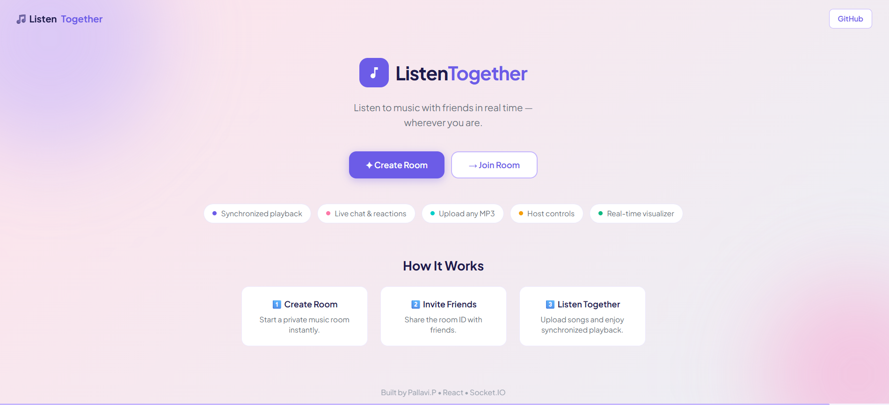
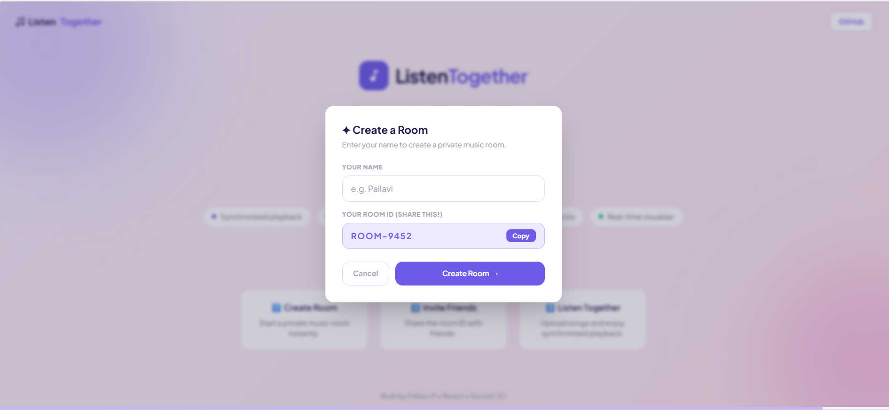
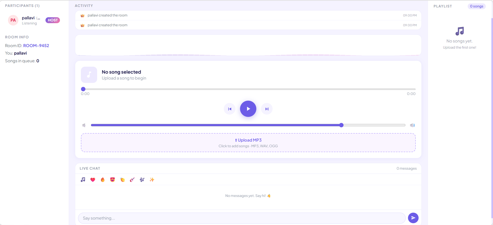

# 🎵 ListenTogether

ListenTogether is a real-time music room web application where users can create rooms and listen to music together with synchronized playback.
## Home Page

---

## Join Room

---

## Music Room Interface

---

## Features

- Create music rooms
- Join rooms using Room ID
- Upload MP3 songs
- Real-time synchronized playback
- Live chat
- Playlist management
- Host controls
- Modern responsive UI

## Tech Stack

Frontend
- React
- Tailwind CSS

Backend
- Node.js
- Express
- Socket.IO

## Project Structure
listentogether
│
├── client
├── server
└── README.md

## Run Locally

### Start Server
- cd server
- npm install
- npm start

### Start Client
- cd client
- npm install
- npm run dev

Open in browser:
http://localhost:5173
live:https://listentogether-xi.vercel.app

## Future Improvements

- Database integration
- User authentication
- Music streaming APIs

## Author

Pallavi Puligila
